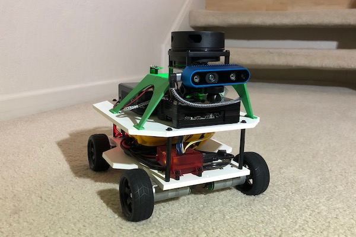
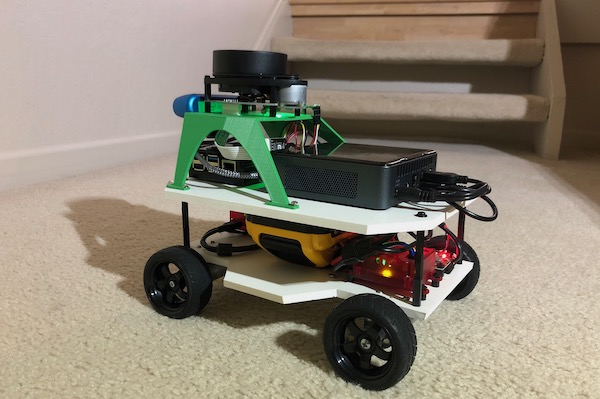
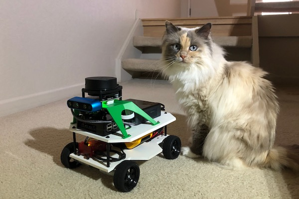

# Wrapping up B2
_October 2020_

This project has come a long way. Admitedly, it's still not the hide-and-seek robot that it was origionally designed for. But I've learned a lot over the past several years, and my kids are older, and now a hide-and-seek robot is less useful of a goal. So my kids and I decided that we would evolve the goal into a robot that did something more useful, and would give me a reason to do more interesting things with the robot.

We decided to make a robot that would navigate around the downstairs using all of the sensing and nav built for B2, while applying robot vision to detect cat toys scattered around the floor, pick them up using a robotic arm, and then return them to a central spot. I find myself doing this a lot as our cat leaves toys all over the place. So why not create a robot to do this chore for me?

The new robot will need a new chassis to hold a robotic arm, and a bunch of more software for the robot vision and arm control. Therefore we decided it should have a new name also.

So it is with fond memories, and a brain full of new robot knowlege, we close off the B2 project and open up a new project. 

And our infamous cat who's toys will be the focus on the next robot project.

Check out the new [robot project's page](/r2b2/initial-design/design-goals).
