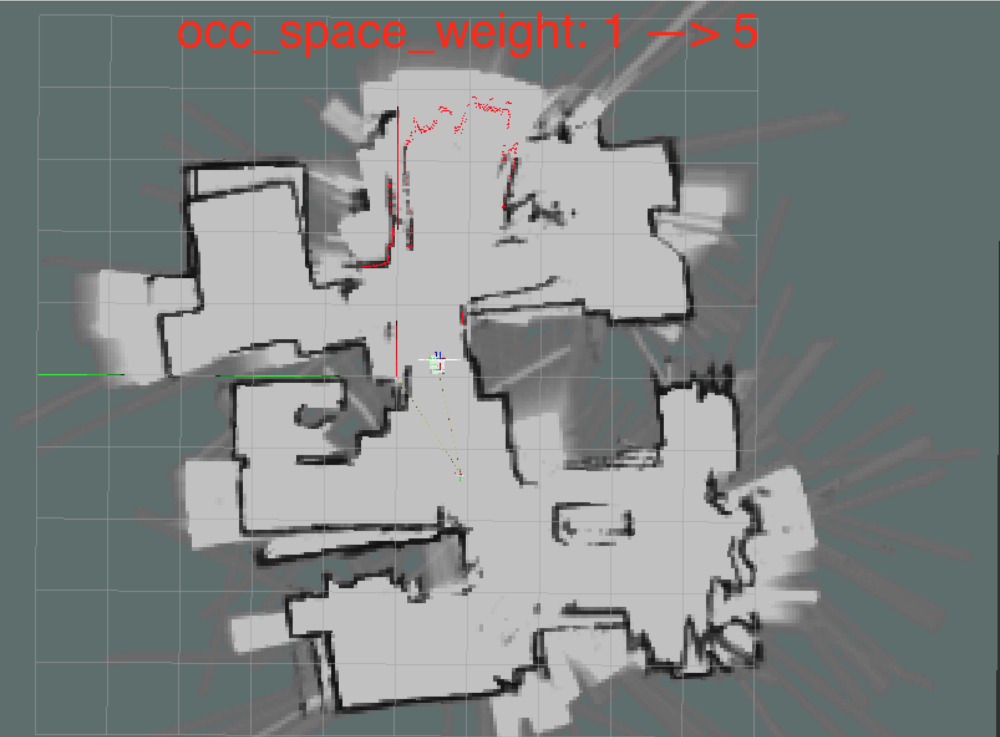
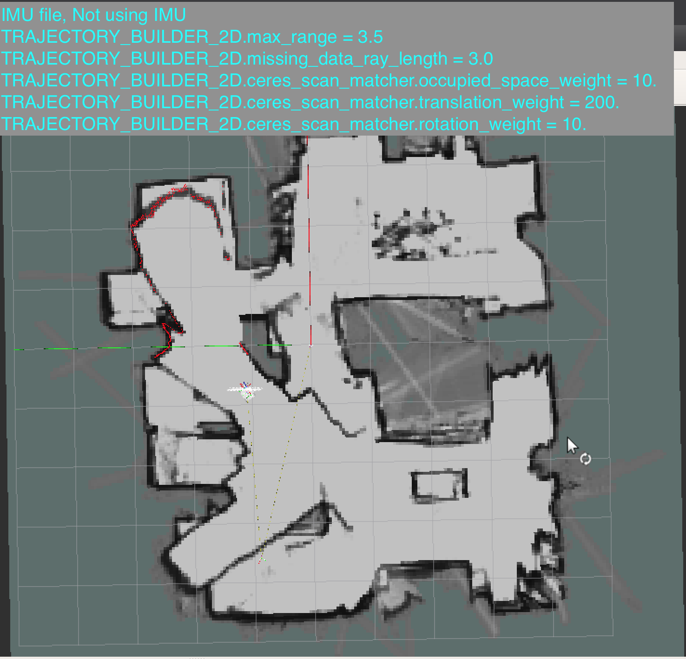
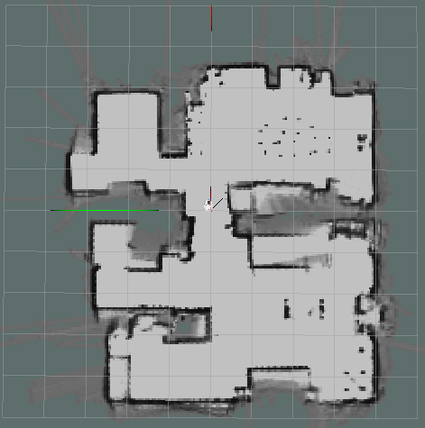
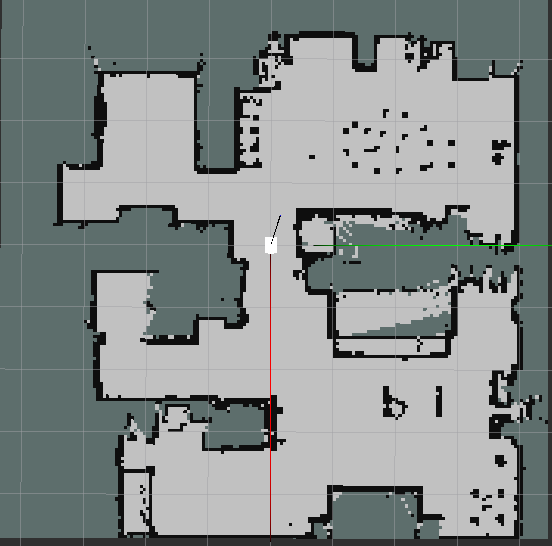

# Tuning Cartographer and SLAM
_April 2020_

Tuning is ongoing and although I'm getting maps, they are not quite usable yet. I'm still learning how to tune Google Cartographer for the B2 robot platform.

I believe I have local SLAM working pretty well. When I use the Cartographer Rviz plugin by launching Rviz from my [`b2-slam`](https://github.com/sheaffej/b2-slam) package using [rviz.launch](https://github.com/sheaffej/b2-slam/blob/dev/b2_slam/launch/rviz.launch), I can inspect each submap created.

Each submap on its own looks good. But the submaps are not aligning correctly with each other when Global SLAM is disabled. This is causing rooms to have the double-wall effect where the walls are misaligned in the resulting occupancy grid map.

Then when I turn on Global SLAM, the submaps are squeezed together toward the center of the map, little by little, each time that Global SLAM executes in the background. That really messes up the map.

So I believe I have submap creation working well. But need to tune how the maps are constrained together both in Local SLAM, and in Global SLAM.

More to come.

----
_Sep 2020_

It took me 5 months before I had enough progress to write about. During that time, I also started a new job, so that consumed a lot of my time.

I continued to struggle to get a good map with Google Cartographer. The maps were begining to look like my downstairs floor, but they were still too warped to be useful. Depending on the settings, I would get maps like this:

Or this:

I tried adding an IMU (see [`b2-imu`](https://github.com/sheaffej/b2-imu) docker node), and also tried 3D SLAM since the RealSense can output a 3D pointcloud. But neither of these yielded significantly better maps.

I concluded that the problem was partially because I was using an Intel RealSense camera to create my laser scan. The RealSense has a depth camera field of view of 86°, so the scans used by SLAM were only 86° in coverage. The majority of the SLAM examples I found were using 360° scanners. Therefore I surmised that the SLAM algos or at least the default settings were assuming a 360° scanner. I decided to buy the [RPLIDAR A1 laser scanner](https://www.slamtec.com/en/Lidar/A1) that I was considering before I received the Intel RealSense. 

This made a big difference. With Google Cartographer using settings very close to the defaults, I obtainted this map.

.

# Switching to slam-toolbox

However, I decided to move away from Google Cartographer because it appears to not be maintained anymore. Instead, I tested out [`slam-toolbox`](https://github.com/SteveMacenski/slam_toolbox), which I heard about on the [ROS Developer's Podcast](https://www.theconstructsim.com/the-ros-slam-toolbox-by-steve-macenski/), as well as [Steve Macenski's significant participation](https://answers.ros.org/users/25940/stevemacenski/) in the ROS forums. Using `slam-toolbox` and mostly default settings, with the RPLIDAR A1 I was able to achieve this map.

I only [changed](https://github.com/sheaffej/b2-nav/blob/4cc5fcce4ba82638980a72289eb2fec5f8b66ca7/b2_slam_toolbox/config/mapper_params_online_sync.yaml) the main parameters like frame names, and also decreased the [`minimum_travel_XXX`](https://github.com/SteveMacenski/slam_toolbox/blob/5904790a04cc77618381eee87c6f549348e0eb42/lib/karto_sdk/src/Mapper.cpp#L2036) parameters because I have a small space I'm mapping whereas `slam-toolbox` is designed to map very large spaces.

After creating the map, I saved it using `slam-toolbox`'s `/slam_toolbox/save_map` service, which saves a `.pgm` and `.yaml` file containing the map as an occupancy grid.

**Next:** [Navigation with `move_base`](/b2/nav/nav-with-move_base) 