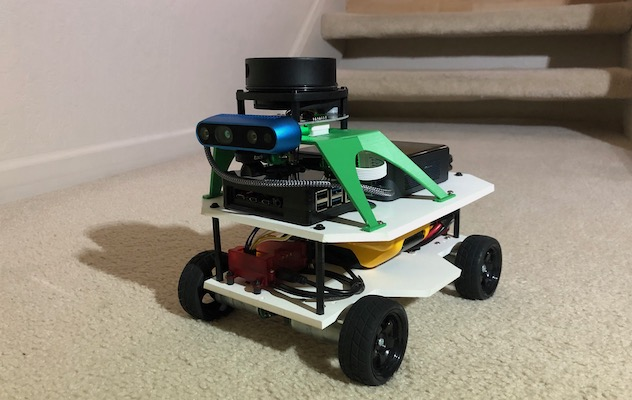

# Recovery Robot B2 (R2B2)

R2B2 is the next phase of my robot project which builds upon the B2 robot. 

Its design goal is to autonomously navigate around the floor looking for cat toys of various types, pick them up, and deliver them to a central storage spot (i.e where we continually put them, just so the cat can spread them all over again).

  
_(Artist's concept created by my daughter)_

R2B2 is a ROS2 robot, built upon the autonomous navigation platform that I built as the B2 robot with ROS1. This robot will add computer vision (CV) object detection, some form of arm and end-effector to pick up the cat toys, and control logic to perform its task autonomously.

### Read More:
1. [Design goals](r2b2/initial-design/design-goals)
2. [Arming the robot](r2b2/initial-design/arming-the-robot)
3. [Object detection - Part 1](r2b2/initial-design/yolo-obj-detection-1)
4. [Converting to ROS2](r2b2/conversion/roboclaw-and-base)

---

# B2 Robot Project (ROS)

This is my ROS project consisting of the custom code for my robot named **B2**.

The B2 robot was my first attempt to build a fully ROS robot platform that could navigate around the downstairs of my house autonomously when provided a starting pose and a goal pose. The robot uses SLAM and LIDAR for mapping, AMCL for localization, and ROS `move_base` for navigational planning. It has a custom `base_node` and `roboclaw_driver` node that I implemented using Python and `rospy`.

### Read More:
1. [The Initial Design](b2/2wd-base/InitialDesign)
2. [Building the 2-wheel Differential Drive Base](b2/2wd-base/Building-the-Drive-Base)
3. [Teleoperation to Obstacle Sensing](b2/2wd-base/Teleoperation-to-Obstacle-Sensing)
4. [Initial Autonomous Driving](b2/2wd-base/Initial-Autonomous-Driving)
5. [Rethinking the Design](b2/4wd-base/rethinking-the-design)
6. [Moving to Docker](b2/4wd-base/moving-to-docker)
7. [I finally came to my RealSense(s)](b2/4wd-base/intel-realsense)
8. [SLAM with Google Cartographer](b2/slam/slam-with-cartographer)
9. [Tuning Cartographer](/b2/slam/tuning-cartographer)
10. [Navigation with move_base](/b2/nav/nav-with-move_base)
11. [Wrapping up the B2 project](/b2/nav/wrapping-up)

---

# Otto - Smart Home Automation
Otto is an automation engine for [Home Assistant](https://www.home-assistant.io/).

This is a general purpose automation engine that integrates with [Home Assistant](https://www.home-assistant.io/), and provides higher fidelity automation rules and flexibility than Home Assistant's built-in automation capability.

There are two projects for Otto:
* `otto-engine`
  * [https://github.com/sheaffej/otto-engine](https://github.com/sheaffej/otto-engine)
  * Python rules engine using asyncio
* `otto-ui`
  * [https://github.com/sheaffej/otto-ui](https://github.com/sheaffej/otto-ui)
  * Angular 2+ Web UI for buiding and managing rules