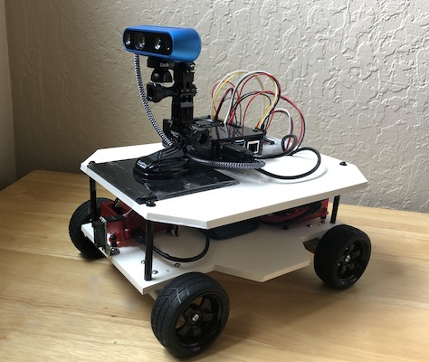

# B2 Robot Project (ROS)

This is my ROS project consisting of the custom code for my robot named **B2**.

### Read More:
1. [The Initial Design](b2/2wd-base/InitialDesign)
2. [Building the 2-wheel Differential Drive Base](b2/2wd-base/Building-the-Drive-Base)
3. [Teleoperation to Obstacle Sensing](b2/2wd-base/Teleoperation-to-Obstacle-Sensing)
4. [Initial Autonomous Driving](b2/2wd-base/Initial-Autonomous-Driving)
5. [Rethinking the Design](b2/4wd-base/rethinking-the-design)
6. [Moving to Docker](b2/4wd-base/moving-to-docker)
7. [I finally came to my RealSense(s)](b2/4wd-base/intel-realsense)
8. [SLAM with Google Cartographer](b2/slam/slam-with-cartographer)

# Otto - Smart Home Automation
Otto is an automation engine for [Home Assistant](https://www.home-assistant.io/).

This is a general purpose automation engine that integrates with [Home Assistant](https://www.home-assistant.io/), and provides higher fidelity automation rules and flexibility than Home Assistant's built-in automation capability.

There are two projects for Otto:
* `otto-engine`
  * [https://github.com/sheaffej/otto-engine](https://github.com/sheaffej/otto-engine)
  * Python rules engine using asyncio
* `otto-ui`
  * [https://github.com/sheaffej/otto-ui](https://github.com/sheaffej/otto-ui)
  * Angular 2+ Web UI for buiding and managing rules