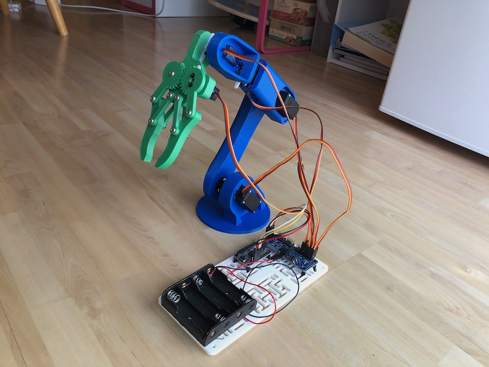

# Arming the robot
_November 2020_

I mean, putting an arm on it - I'm not a monster!

And as I thought about how to evolve the B2 robot into the R2B2 robot, I identified two main things I would have to learn and build:

- A computer vision object detection capability to detect cat toys and localize them within the world frame
- An arm and related control software to pick up the cat toys, and hold them until they can be dropped at the target location

I decided to tackle the arm part first since the computer vision object detection part seemed more intimidating. Later, I would learn it's actually the opposite. 

I spent some time finding robotic arm parts that I could obtain through buying or building. Many robot arms are availble for purchase, but most of them either are very expensive, or part of some toy and not really suitable for a working robot. Ultimately I found a 3D model I was able to 3D print. I purchased some servors and started playing around with ROS's MoveIt Motion Planning Framework.

Parts list:

I obtained the 3D model from here: <a href="https://thangs.com/designer/m/3d-model/38899">https://thangs.com/designer/m/3d-model/38899</a>

And use these large servos: <a href="https://www.amazon.com/gp/product/B07F7YZW7Q/ref=ppx_yo_dt_b_search_asin_title?ie=UTF8&th=1">Amazon link</a>

And these small servos: <a href="https://www.amazon.com/gp/product/B07MLR1498/ref=ppx_yo_dt_b_search_asin_title?ie=UTF8&psc=1">Amazon link</a>

And used this I2C servo driver motor: <a href="https://www.adafruit.com/product/815">https://www.adafruit.com/product/815</a>

And this USB-to-I2C board <a href="https://www.adafruit.com/product/2264">https://www.adafruit.com/product/2264</a>

In doing so, I learned a few things:

**The ROS MoveIt motion planning framework is awesome!**

Assuming you know where the object is that you want to pick up, MoveIt does all the work of planning the commands to your actuators to put the arm in the right position to pick up the object.

**The mechanical engineering part of the arm is by far more difficult than the software part**

Largely in part because MoveIt does the vast majority of the work for you. But also, it's easy to design an arm that looks great, but when you build it the weight of the parts and the size of the arm can make it infeasible to use. Specifically, when the arm stretches out to pick something up, it has all of its weight forward of its mount point on the robot. Not only does this mean the robot is likely to tip forward because of the shift the center of gravity, but also all of that arm weight needs to be overcome by the servos when moving the arm.

It's hard enough to get the arm to move properly on the robot without the servos hitting their max torque limits. But then remember that you need the arm to pick up something, which is even more weight at the far end of the arm. Fortunately, R2B2 will be picking up cat toys, which are very light.

Ultimately, I realized that the arm I built is just too heavy and complicated (but looks great!) and I needed to do some more mechanical design work to choose a better arm. And to do proper design, I need to know what my requirements are, and since I only just started thinking about how R2B2 would work, I didn't really have my requirements flushed out yet. I need to figure out how the robot will detect, localize, and generally interact with the cat toys, before I can effectively design the arm that will allow that interaction to happen.

So I'm pausing the work on the arm, and I'll switch to the task of cat toy object detection next. I'll come back to the arm once my robot can detect cat toys and calculate the toy's position in the world frame. 

My intention at that point is to brush up on my Fusion 360 skills and start modeling an arm that will work specifically with my robot. I may decide to print the arm myself, or I may send it out for printing. I've learned that 3D printing services can be fairly economical if you can afford to wait (or if you need large quantities). But if you need a small job done quickly, that becomes very expensive. Fortunately, I'm not in a hurry with my project, so I can use time to reduce the cost of professional fabrication of my arm parts.

**Next:** [Object Detection - Part 1](/r2b2/initial-design/yolo-obj-detection-1)