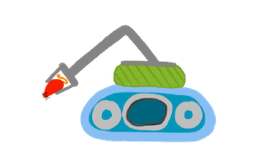

# Design Goals - Recovery Robot B2 (akam R2B2)
_October 2020_

  
_(Artist's concept created by my daughter)_

Having accomplished a lot working on the B2 robot, we decided to take what we learned and build upon it. The next robot would navigate around the downstairs using all of the sensing and nav built for B2, apply robot vision to detect cat toys scattered around the floor, pick them up using a robotic arm, and then return them to a central spot.

This is a task I find myself doing this a lot as our cat leaves toys all over the place. So why not create a robot to perform this task for me?

R2-B2 will need a new chassis to hold a robotic arm, and a bunch of more software for the robot vision and arm control.

Let's define the goals of the robot:

### Key Goals:
1. __Perform its task in an autonomous manner__.
 * That is, not have to be supervised or controlled by any human.
2. __Find cat toys laying on the floor__.
* Cat toys come in various types and sizes (fuzzy balls, fake mice, springs, crinkly toys, etc) so the robot must be able to identify multiple candidate objects.
* I will have to train the robot on what the candidate toys look like. So if we buy a new toy, I do not expect the robot to recognize that toy until it has been trained (bonus points if it does anyways).
* I do not expect it to find cat toys on the stairs, or on furniture, nor in spots the robot cannot access such as under the refigerator.
3. __Pick up the cat toy__.
* The robot must be able to collect the toy. I expect to use a robotic arm to do this, but I'll leave that open as I may find a better way to do this like a scoop. I do want to have some sort of multiple DOF articulator, so an arm seems like a logical solution at this stage of the project.
4. __Return the toy to a designated toy repository__.
* We have a spot already where we put all of the cat toys we pick up around the house, but it's too high for a floor-based robot to reach. Therefore I'll pick another location and use this as the "designated toy repository".

### Stretch Goals:
A. __Determine when it has completed its task__. And return to a defined location and then shutdown to conserve its battery.

With these goals in mind, our next step is to work on an initial structural design.

**Next:** [Arming the robot](/r2b2/initial-design/arming-the-robot.md)